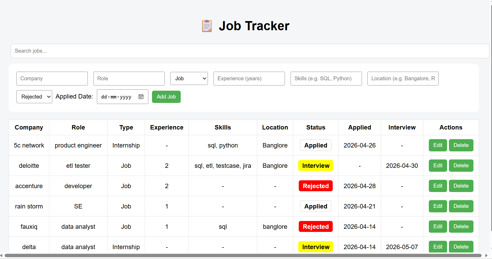

# 📋 Job Tracker Web App

A simple and powerful Job Tracker built using HTML, CSS, and JavaScript.

## 🚀 Features

- Add, edit, delete job applications
- Track Internship / Job separately
- Status tracking (Applied, Interview, Rejected, Offer)
- 🎨 Color-coded status indicators
- 📅 Sort by applied date
- 🔍 Search functionality
- 📍 Location tracking
- 💾 Data stored using LocalStorage

---

## 📸 Screenshot

---

## 🛠️ Tech Stack

- HTML
- CSS
- JavaScript

---

## 🌐 Live Demo

(Add your GitHub Pages link here after deployment)

---

## 📂 Project Structure
